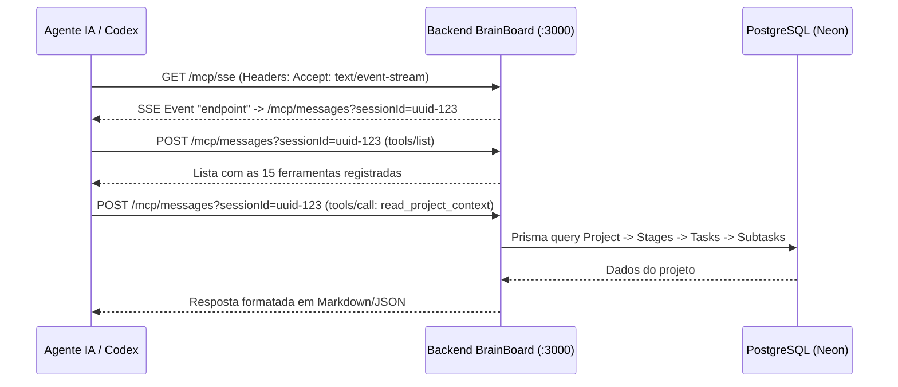

# 🧠 BrainBoard MCP — Documentação Técnica e Guia de Integração

O **BrainBoard** expõe um servidor oficial compatível com a especificação aberta **Model Context Protocol (MCP)** através de transporte web **SSE (Server-Sent Events)**. 

Isso permite que qualquer agente de Inteligência Artificial (**Codex, Claude Desktop, Cursor, Cline, Roo Code, VS Code, Python SDK, Aider**, etc.) conecte-se ao BrainBoard, leia o contexto dos projetos e manipule quadros Kanban, tarefas, subtarefas e diários de bordo em tempo real.

---

## 1. 🌐 Arquitetura e Endpoints do Servidor

O servidor MCP opera na porta configurada no backend (padrão: `3000`).

| Protocolo | Método | Endpoint | Descrição |
| :--- | :---: | :--- | :--- |
| **Streamable HTTP (Codex/Modern)** | `POST` / `ALL` | `http://localhost:3000/mcp` | Endpoint oficial para o Codex e clientes MCP modernos com suporte a sessões. |
| **SSE Stream (Legacy)** | `GET` | `http://localhost:3000/mcp/sse` | Estabelece o canal de eventos contínuos com a IA e inicializa a sessão. |
| **JSON-RPC Post (Legacy)** | `POST` | `http://localhost:3000/mcp/messages?sessionId={uuid}` | Canal de envio de comandos e chamadas de ferramentas (*tool calls*). |
| **Health Check** | `GET` | `http://localhost:3000/api/health` | Verificação de integridade e liveness do servidor. |

### Fluxo de Comunicação


---

## 2. ⚙️ Como Configurar em Clientes e IAs

### A. Codex (Terminal / Configuração TOML)
No arquivo de configuração do seu Codex (ex: `config.toml` ou similar):

```toml
[mcp_servers.brainboard]
url = "http://localhost:3000/mcp"
```
*(O endpoint `/mcp` suporta a especificação completa de Streamable HTTP com sessões automáticas).*

---

### B. Claude Desktop
No seu arquivo de configuração do Claude (`%APPDATA%\Claude\claude_desktop_config.json` no Windows ou `~/Library/Application Support/Claude/claude_desktop_config.json` no macOS):

```json
{
  "mcpServers": {
    "brainboard": {
      "command": "npx",
      "args": ["-y", "mcp-remote", "http://localhost:3000/mcp/sse"]
    }
  }
}
```

---

### B. Cursor IDE / Cline / Roo Code / VS Code
Se o cliente suportar transporte HTTP/SSE nativo (configuração `.cursor/mcp.json` ou similar):

```json
{
  "mcpServers": {
    "brainboard": {
      "url": "http://localhost:3000/mcp/sse"
    }
  }
}
```
*Se exigir comando stdio:*
```json
{
  "mcpServers": {
    "brainboard": {
      "command": "npx",
      "args": ["-y", "mcp-remote", "http://localhost:3000/mcp/sse"]
    }
  }
}
```

---

### C. Codex em Terminal / Scripts / Agentes via CLI
Para IAs rodando em outros terminais ou scripts locais que usam linha de comando, você pode instruir o agente a usar comandos `curl` diretamente contra os endpoints REST do BrainBoard:

```bash
# 1. Ler contexto completo do projeto
curl -s http://localhost:3000/api/projects/<PROJECT_ID>

# 2. Criar uma tarefa em uma etapa
curl -X POST http://localhost:3000/api/stages/<STAGE_ID>/tasks \
  -H "Content-Type: application/json" \
  -d '{"title": "Nome da Tarefa", "description": "Detalhes", "status": "TODO"}'

# 3. Mover tarefa para IN_PROGRESS ou DONE
curl -X PATCH http://localhost:3000/api/tasks/<TASK_ID> \
  -H "Content-Type: application/json" \
  -d '{"status": "DONE"}'

# 4. Criar e alternar subtarefa
curl -X POST http://localhost:3000/api/tasks/<TASK_ID>/subtasks \
  -H "Content-Type: application/json" \
  -d '{"title": "Implementar módulo de conexão"}'

curl -X PATCH http://localhost:3000/api/subtasks/<SUBTASK_ID> \
  -H "Content-Type: application/json" \
  -d '{"isDone": true}'

# 5. Criar registro de diário de bordo (UpdateLog)
curl -X POST http://localhost:3000/api/projects/<PROJECT_ID>/update-logs \
  -H "Content-Type: application/json" \
  -d '{"title": "Marco de entrega", "content": "Descrição detalhada...", "author": "Codex"}'
```

---

### D. Acesso Remoto (Outra máquina ou Nuvem)
Se o Codex ou a IA estiver fora da rede local (ex: VM remota, cloud runner):
1. No computador onde o BrainBoard roda:
   ```powershell
   npx localtunnel --port 3000
   ```
2. Utilize a URL pública gerada (ex: `https://meu-brainboard.loca.lt/mcp/sse`).

---

## 3. 🛠️ Catálogo Completo das 15 Ferramentas MCP

### 📌 Gestão de Projetos e Contexto

#### 1. `read_project_context`
Carrega a visão 360° do projeto para a IA: regras de negócio, repositório GitHub, configurações, etapas, tarefas, subtarefas, membros e diários de bordo.
* **Argumentos:**
  * `projectId` *(string, obrigatório)*: UUID do projeto.
* **Exemplo de payload:**
  ```json
  { "projectId": "98d7eb43-ef20-44c9-bc70-161f7bb8f9b1" }
  ```

#### 2. `update_business_logic`
Atualiza a especificação de arquitetura e regras de negócio do projeto em Markdown.
* **Argumentos:**
  * `projectId` *(string, obrigatório)*: UUID do projeto.
  * `businessLogic` *(string, obrigatório)*: Conteúdo completo em Markdown.

#### 3. `update_project_settings`
Atualiza configurações JSON dinâmicas, URL do repositório GitHub e/ou documentação.
* **Argumentos:**
  * `projectId` *(string, obrigatório)*: UUID do projeto.
  * `githubRepo` *(string, opcional)*: URL ou slug do repositório.
  * `settings` *(object, opcional)*: Objeto JSON com configurações (stack, portas, etc.).
  * `businessLogic` *(string, opcional)*: Texto em Markdown.

#### 4. `log_project_update`
Gera uma entrada no Diário de Bordo do projeto com data, autor e formatação Markdown.
* **Argumentos:**
  * `projectId` *(string, obrigatório)*: UUID do projeto.
  * `title` *(string, obrigatório)*: Título da atualização.
  * `content` *(string, obrigatório)*: Texto descrevendo o que foi entregue/alterado.
  * `author` *(string, opcional)*: Nome do autor (padrão: `AI Agent`).

---

### 📋 Gestão de Tarefas (Kanban)

#### 5. `create_task` *(Alias: `add_task`)*
Cria uma nova tarefa associada a uma etapa (*Stage*).
* **Argumentos:**
  * `stageId` *(string, obrigatório)*: UUID da etapa à qual a tarefa pertence.
  * `title` *(string, obrigatório)*: Título da tarefa.
  * `description` *(string, opcional)*: Descrição detalhada.
  * `status` *(string, opcional)*: `'TODO'`, `'IN_PROGRESS'` ou `'DONE'`. Padrão: `'TODO'`.

#### 6. `move_task` *(Alias: `update_task_status`)*
Altera o status de uma tarefa no Kanban ou move-a para outra etapa.
* **Argumentos:**
  * `id` *(string, obrigatório)*: UUID da tarefa.
  * `status` *(string, obrigatório)*: `'TODO'`, `'IN_PROGRESS'` ou `'DONE'`.
  * `stageId` *(string, opcional)*: UUID da nova etapa (se estiver movendo de etapa).

#### 7. `update_task`
Atualiza metadados de uma tarefa existente (título, descrição, status ou etapa).
* **Argumentos:**
  * `id` *(string, obrigatório)*: UUID da tarefa.
  * `title` *(string, opcional)*
  * `description` *(string, opcional)*
  * `status` *(string, opcional)*
  * `stageId` *(string, opcional)*

#### 8. `delete_task`
Remove uma tarefa e deleta automaticamente todas as suas subtarefas em cascata.
* **Argumentos:**
  * `id` *(string, obrigatório)*: UUID da tarefa.

#### 9. `get_task`
Obtém os detalhes completos de uma tarefa específica e sua lista de subtarefas.
* **Argumentos:**
  * `id` *(string, obrigatório)*: UUID da tarefa.

#### 10. `list_tasks`
Filtra e lista tarefas cadastradas.
* **Argumentos:**
  * `stageId` *(string, opcional)*: Filtra por etapa.
  * `status` *(string, opcional)*: Filtra por `'TODO'`, `'IN_PROGRESS'` ou `'DONE'`.

---

### ☑️ Gestão de Subtarefas (Checklist)

#### 11. `add_subtask`
Adiciona um item de checklist a uma tarefa.
* **Argumentos:**
  * `taskId` *(string, obrigatório)*: UUID da tarefa pai.
  * `title` *(string, obrigatório)*: Texto do item.

#### 12. `toggle_subtask`
Marca ou desmarca uma subtarefa como concluída.
* **Argumentos:**
  * `id` *(string, obrigatório)*: UUID da subtarefa.
  * `isDone` *(boolean, opcional)*: Se omitido, inverte o estado atual (`true` <-> `false`).

#### 13. `delete_subtask`
Exclui uma subtarefa específica do checklist.
* **Argumentos:**
  * `id` *(string, obrigatório)*: UUID da subtarefa.

---

## 4. 📝 Prompt Recomendado para Enviar ao Agente / Codex

Cole este bloco de instruções para inicializar o seu agente com conhecimento total do BrainBoard:

```markdown
Você está integrado ao sistema de gerenciamento de projetos BrainBoard via MCP / REST (http://localhost:3000).

Diretrizes de Operação:
1. Sempre inicie executando `read_project_context(projectId: "<ID_DO_PROJETO>")` para compreender as etapas e o estado atual do desenvolvimento.
2. Antes de iniciar uma tarefa, atualize o status para "IN_PROGRESS" usando `move_task`.
3. Conforme avançar no código, marque os itens do checklist com `toggle_subtask(id: "<SUBTASK_ID>", isDone: true)`.
4. Ao concluir entregas ou marcos relevantes, mova a tarefa para "DONE" e registre uma entrada no diário de bordo com `log_project_update`.
```
